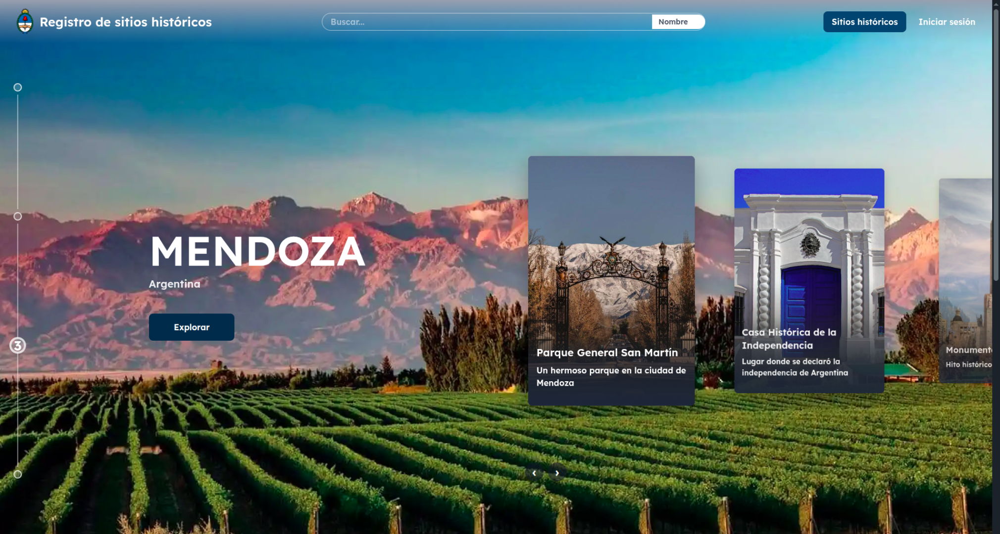
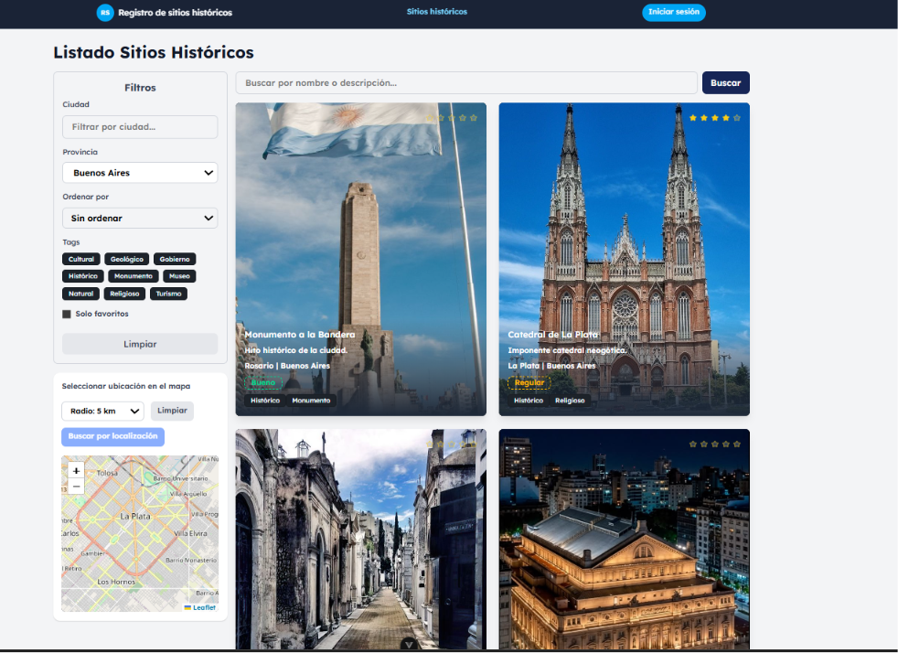
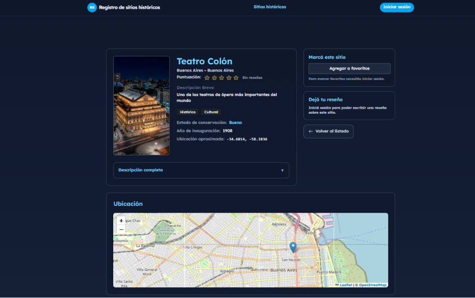
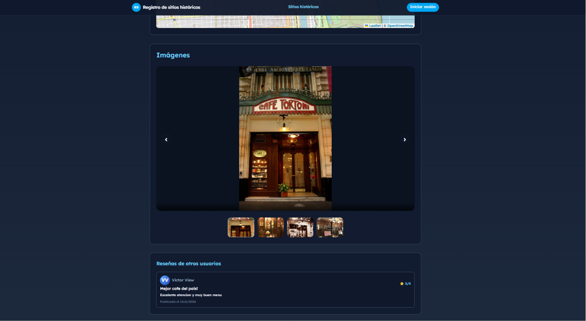

# Sitios históricos Argentina

Aplicación web full-stack orientada a la exploración, gestión y difusión de sitios históricos de Argentina. La plataforma permite a administradores gestionar contenido y ubicaciones históricas, mientras que los usuarios pueden descubrir, calificar y reseñar lugares de interés cultural mediante herramientas interactivas y geolocalización.

## Funcionalidades Principales

#### Usuarios

- Exploración de sitios históricos mediante mapas interactivos
- Visualización de información detallada de cada sitio
- Sistema de calificaciones y reseñas
- Búsqueda y filtrado de ubicaciones
- Gestión de perfiles de usuario

#### Administradores

- Alta, edición y eliminación de sitios históricos
- Moderación de reseñas y contenido
- Gestión de imágenes y contenido multimedia
- Administración de información geográfica

## Despliegue

- Portal : https://grupo45.proyecto2025.linti.unlp.edu.ar/

- Admin: https://admin-grupo45.proyecto2025.linti.unlp.edu.ar/

## Colaboradores

- Augusto Marinelli
- Diego Garcia Herd
- Fiorella Valente
- Nicolas Hermida
- Valentin Paolini

## Stack Tecnológico

#### Backend

- Python
- Flask
- PostgreSQL
- PostGIS
- MinIO

#### Frontend

- Vue.js
- Tailwind CSS

## Arquitectura

El sistema fue desarrollado utilizando una arquitectura cliente-servidor separando frontend y backend mediante APIs REST.

- Backend desarrollado con Flask
- Base de datos PostgreSQL con soporte geoespacial PostGIS
- Frontend SPA utilizando Vue.js
- Almacenamiento de archivos multimedia con MinIO
- Contenedorización completa mediante Docker

## Capturas

Algunas capturas de la aplicación en desarrollo:

<p align="center">
	
</p>

<p align="center">
	
</p>

<p align="center">
	
</p>

<p align="center">
	
</p>

<p align="center">
	
</p>


## Requisitos

- **Python**: >=3.12 and <4 (ver [admin/pyproject.toml](admin/pyproject.toml#L1-L41)).
- **Poetry**: >=2.x (recomendado para el backend).
- **Node.js**: compatible con `^20.19.0` o `>=22.12.0` (ver [portal/package.json](portal/package.json#L1-L38)).
- **Base de datos**: PostgreSQL con extensión **PostGIS** para datos geoespaciales.
- **Almacenamiento de objetos**: MinIO (se provee `minio-local/docker-compose.yml`).
- **Docker / Docker Compose**: recomendado para entornos locales y despliegue.

## Instalación rápida (resumen)

1. Clonar el repositorio:

```bash
git clone <URL-Repositorio>
cd proyecto
```

2. Crear archivos de entorno a partir de los ejemplos:

```bash
cp admin/.env.example admin/.env
cp minio-local/.env.example minio-local/.env
```

3. Ajustar `admin/.env` con `DATABASE_URL`, `SECRET_KEY` y credenciales de MinIO.

4. Levantar servicios auxiliares (MinIO, Postgres con PostGIS) — usar Docker Compose o susinstalaciones locales.

```bash
# ejemplo: levantar sólo MinIO
docker compose -f minio-local/docker-compose.yml up -d
```

5. Instalar dependencias backend y frontend (ver secciones específicas más abajo).

## MinIO y seguridad de credenciales

- El repositorio incluye un `minio-local/docker-compose.yml` de ejemplo. Por seguridad, **no** deje credenciales en texto plano dentro de archivos versionados. En este repo hemos movido la configuración de credenciales a un archivo de entorno (`minio-local/.env`) y el servicio usa `env_file` para cargarlas. Cree `minio-local/.env` a partir de `minio-local/.env.example` y use valores seguros.
- El archivo `admin/.env.example` contiene variables de entorno que debe completar (por ejemplo `DATABASE_URL`, `SECRET_KEY`, `MINIO_ROOT_USER`, `MINIO_ROOT_PASSWORD`). No commitée `admin/.env` ni `minio-local/.env` al control de versiones.
- Para producción recomendamos usar mecanismos de secretos más seguros (Docker secrets, Kubernetes Secrets, Vault, etc.) y rotación periódica de credenciales.

### Creación de buckets (script de ejemplo)

El proyecto incluye un script de inicialización `minio-local/minio-init/create-bucket.sh` que se ejecuta con la imagen `minio/mc`. Ese script utiliza las variables `MINIO_ROOT_USER` y `MINIO_ROOT_PASSWORD` desde el entorno (no desde valores hardcodeados). Si modifica el script o el compose, asegúrese de no introducir credenciales en texto claro.

## Backend (carpeta `admin`) — pasos detallados

1. Instalar Python 3.12 y crear entorno virtual:

```bash
cd admin
python -m venv .venv
source .venv/Scripts/activate  # Windows: .venv\\Scripts\\activate
```

2. Instalar dependencias con Poetry (recomendado):

```bash
poetry install
```

3. Configurar `admin/.env` (usar el ejemplo `admin/.env.example`). Variables importantes:

- `DATABASE_URL` — URL de conexión a PostgreSQL (ej: `postgresql://user:pass@db:5432/dbname`).
- `SECRET_KEY` — clave secreta de Flask para sesiones y firma.
- `MINIO_ROOT_USER`, `MINIO_ROOT_PASSWORD` — credenciales para MinIO (local) o las credenciales de su service S3.

4. Ejecutar la app en desarrollo:

```bash
poetry run python main.py
```

## Frontend (carpeta `portal`)

1. Instalar Node.js (ver versiones en `portal/package.json`).
2. Instalar dependencias y levantar servidor de desarrollo:

```bash
cd portal
npm install
npm run dev
```

## Seguridad

El proyecto usa `Flask-Bcrypt` (`bcrypt`) para hashear contraseñas, mantiene secretos fuera del repositorio mediante archivos `.env` o gestores de secretos, y configura CORS permitiendo sólo orígenes de confianza en producción (no usar `*`). Las sesiones se gestionan con Flask-session.

## Licencia

Proyecto desarrollado de forma colaborativa en el marco de la cursada de Proyecto de Software de la Facultad de Informática UNLP. Grupo 45.

